# Лабораторная работа №1. Виртуальный сервер

## Студент
**Соколов Даниил, группа I2302**  
**Дата выполнения: _11.02.2025_**  

## Описание задачи
Данная лабораторная работа знакомит с виртуализацией операционных систем и настройкой виртуального HTTP сервера. В ходе работы будет установлена виртуальная машина с Debian с гипервизором QEMU, развернут LAMP, установлены PhpMyAdmin и Drupal, а также выполнена настройка виртуальных хостов Apache. Также необходимо будет завершить установку сайтов.

## Выполнение работы

### Подготовка
1. Скачиваю и устанавливаю MYSYS2
   
    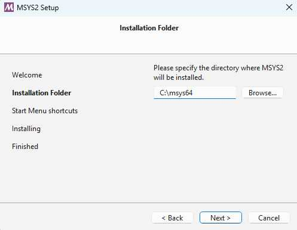

2. Открываю MYSYS2 и создаю папка `lab01` командой `mkdir lab01`
2. В папке `lab01` создаю папку `dvd` и файл `readme.md` командой `cat > readme.md`
3. Открываю официальный сайт **Debian** и копирую ссылку на скачивание образа `64-bit PC DVD-1 iso`
   
   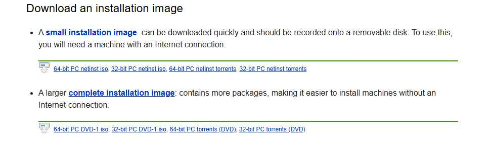

5. Захожу в папку dvd `(cd dvd)` и в консоли выполняю команду для скачивания файла 
```sh
wget -O debian.iso https://cdimage.debian.org/debian-cd/current/amd64/iso-dvd/debian-12.9.0-amd64-DVD-1.iso
```
   `-O` - параметр, который сохраняет скачанный образ как `debian.iso`

7. Скачиваю и устанавливаю **QEMU** командой указанной на оффициальном сайте

   ```sh
   pacman -S mingw-w64-ucrt-x86_64-qemu
   ```
8. **QEMU** установлен.
   
    


### Установка ОС Debian на виртуальную машину
1. В консоли выполняю следующую команду, тем самым создаю образ диска для виртуальной машины размером 8 ГБ, формата qcow2:
   ```sh
   qemu-img create -f qcow2 debian.qcow2 8G
   ```
2. Запускаю установку OC Debian командой:
   ```sh
   qemu-system-x86_64 -hda debian.qcow2 -cdrom dvd/debian.iso -boot d -m 2G
   ```

   Я пытался произвести установку Debian несколько раз. Несколько раз после установки у меня не получалось запустить систему из-за бесконечного запуска с диска
   
   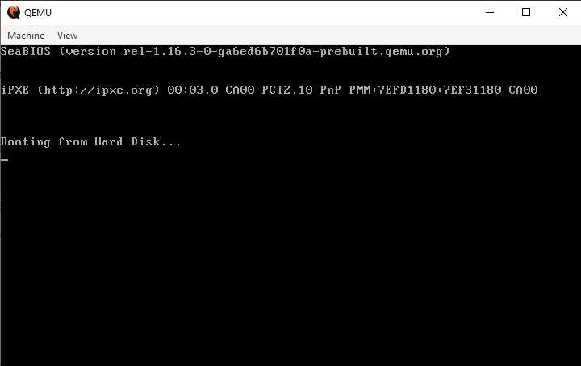

   Удачной попыткой установки была установка с графическим интерфейсом.

    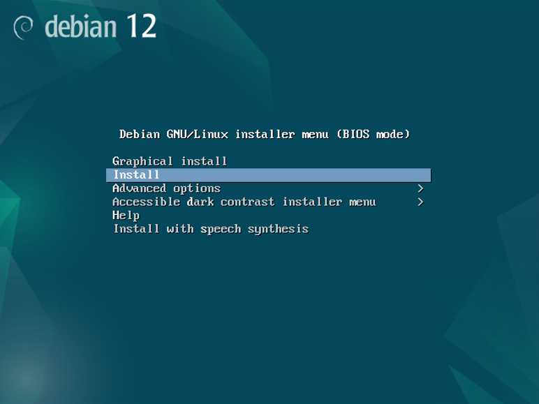
   
3. Установку Debian произвел со следующими параметрами: 
   - Имя компьютера: **debian**
   - Хостовое имя: **debian.localhost**
   - Имя пользователя: **user**
   - Пароль пользователя: **password**

4. Во время установки на этапе Software Selection выбрал для установки только `standart system utilities`, то есть без графической оболочки и рабочего стола.

    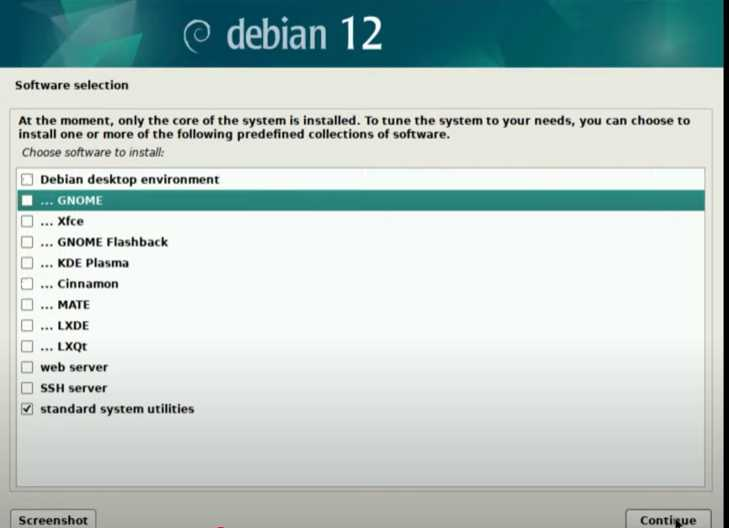

### Запуск виртуальной машины
После установки, с помощью следующей команды запустил систему с виртуального жесткого диска debian.qcow2 с 2Gb RAM, 2 ядрами, создаю NAT-сеть и настраивает проброс портов, что позволяет подключиться к веб-серверу на ВМ через `http://localhost:1080`:
```sh
qemu-system-x86_64 -hda debian.qcow2 -m 2G -smp 2 \
    -device e1000,netdev=net0 -netdev user,id=net0,hostfwd=tcp::1080-:80,hostfwd=tcp::1022-:22
```

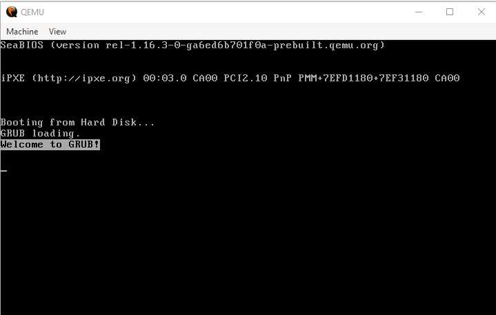

### Установка LAMP
1. Переключение на суперпользователя:
   ```sh
   su
   ```
   
   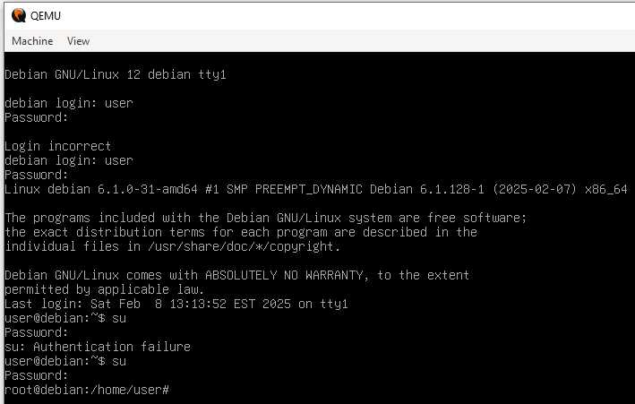
   
2. Во время попытки обновления списка пакетов и установки пакетов командами
   ```sh
   apt update -y
   ``` 
   ```sh
   apt install -y apache2 php libapache2-mod-php php-mysql mariadb-server mariadb-client unzip
   ```
   я столкнулся с ошибками:

   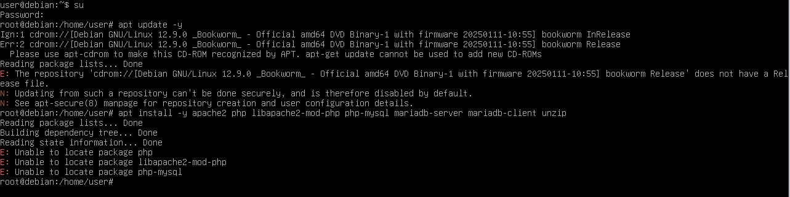

   Это было связано, с тем, что в файле по пути /etc/apt/sources.list не было прописаны ссылки на репозитории, чтобы это решить я добавил в этот файл следующие ссылки:
   
   Чтобы начать редактировать файл, прописал
   ```sh
   nano /etc/apt/sources.list
   ```
   
   и добавил в него:
   ```
   deb http://deb.debian.org/debian bookworm main contrib non-free non-free-firmware
   
   deb  http://security.debian.org/debian-security bookworm-security main contrib non-free non-free-firmware
   
   deb http://deb.debian.org/debian bookworm-updates main contrib non-free non-free-firmware
   ```

   После ввел команды, которые в это раз выполнились без ошибок
   ```sh
   apt update -y
   apt install -y apache2 php libapache2-mod-php php-mysql mariadb-server mariadb-client unzip
   ```
   Вот краткое описание назначения установленных пакетов:

   `apache2` — веб-сервер Apache.
   `php` — интерпретатор PHP для выполнения PHP-скриптов.
   `libapache2-mod-php` — модуль для Apache, позволяющий серверу обрабатывать PHP-код.
   `php-mysql` — расширение PHP для работы с MySQL/MariaDB.
   `mariadb-server` — сервер базы данных MariaDB (форк MySQL).
   `mariadb-client` — клиент для взаимодействия с сервером MariaDB.
   `unzip` — утилита для распаковки ZIP-архивов.

### Установка PhpMyAdmin и CMS Drupal
1. Скачал с помощью следующих команд PhpMyAdmin и CMS Drupal:
   ```sh
   wget https://files.phpmyadmin.net/phpMyAdmin/5.2.2/phpMyAdmin-5.2.2-all-languages.zip
   wget https://ftp.drupal.org/files/projects/drupal-11.1.1.zip
   ```
2. Проверка наличия файлов:
   ```sh
   ls -l
   ```
   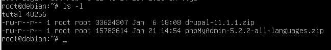
3. Распаковка и перемещение файлов:
   ```sh
   unzip phpMyAdmin-5.2.2-all-languages.zip
   unzip drupal-11.1.1.zip
   ```
   
   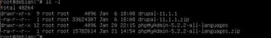
   
   ```sh
   mkdir /var/www
   mv phpMyAdmin-5.2.2-all-languages /var/www/phpmyadmin
   mv drupal-11.1.1 /var/www/drupal
   ```

### Настройка базы данных

   Создаю через командную строку для CMS базу данных drupal_db и пользователя базы данных с именем `daniil`

   ```sh
   mysql -u root
   CREATE DATABASE drupal_db;
   CREATE USER 'daniil'@'localhost' IDENTIFIED BY 'password';
   GRANT ALL PRIVILEGES ON drupal_db.* TO 'daniil'@'localhost';
   FLUSH PRIVILEGES;
   EXIT;
   ```

### Настройка виртуальных хостов Apache
1. Создаю файлы конфигурации:
   - `nano /etc/apache2/sites-available/01-phpmyadmin.conf`
     Вписываю:
      ```
      <VirtualHost *:80>
         ServerAdmin webmaster@localhost
         DocumentRoot "/var/www/phpmyadmin"
         ServerName phpmyadmin.localhost
         ServerAlias www.phpmyadmin.localhost
         ErrorLog "/var/log/apache2/phpmyadmin.localhost-error.log"
         CustomLog "/var/log/apache2/phpmyadmin.localhost-access.log" common
      </VirtualHost>
      ```
   - `nano /etc/apache2/sites-available/02-drupal.conf`
     
      Вписываю:
      ```
      <VirtualHost *:80>
         ServerAdmin webmaster@localhost
         DocumentRoot "/var/www/drupal"
         ServerName drupal.localhost
         ServerAlias www.drupal.localhost
         ErrorLog "/var/log/apache2/drupal.localhost-error.log"
         CustomLog "/var/log/apache2/drupal.localhost-access.log" common
      </VirtualHost>
      ```
2. Зарегистрировал конфигурации:
   ```sh
   /usr/sbin/a2ensite 01-phpmyadmin
   /usr/sbin/a2ensite 02-drupal
   ```
3. Добавил записи в `/etc/hosts`:
   ```sh
   127.0.0.1 phpmyadmin.localhost
   127.0.0.1 drupal.localhost
   ```

   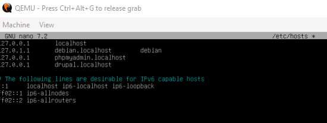

### Запуск и тестирование
1. Проверяю версию системы:
   ```sh
   uname -a
   ```
   
   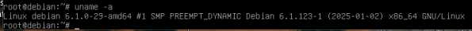
   
3. Перезапускаю Apache:
   ```sh
   systemctl restart apache2
   ```
4. Проверка доступности сайтов в браузере:
   - `http://drupal.localhost:1080`
   - `http://phpmyadmin.localhost:1080`

  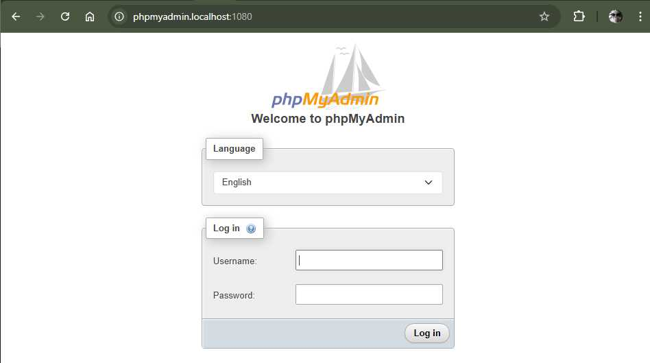

  
  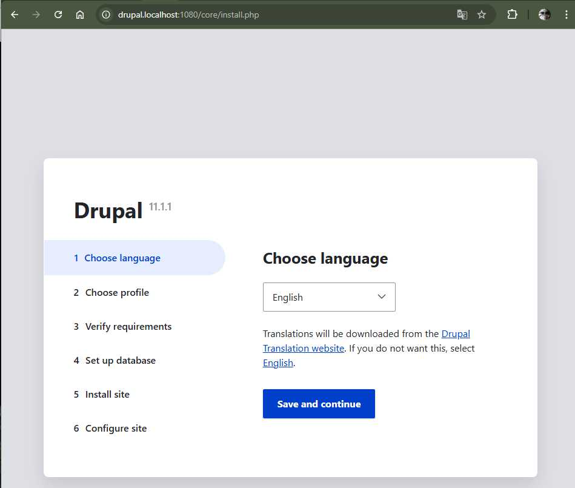

5.Начинаю завершать установку drupal

   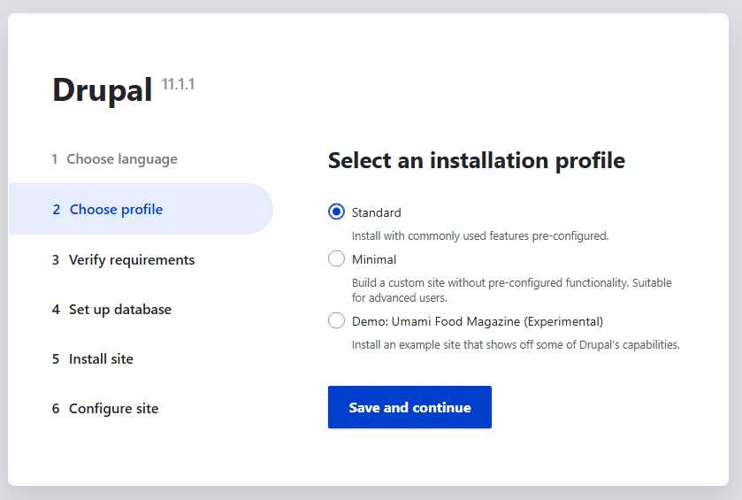

   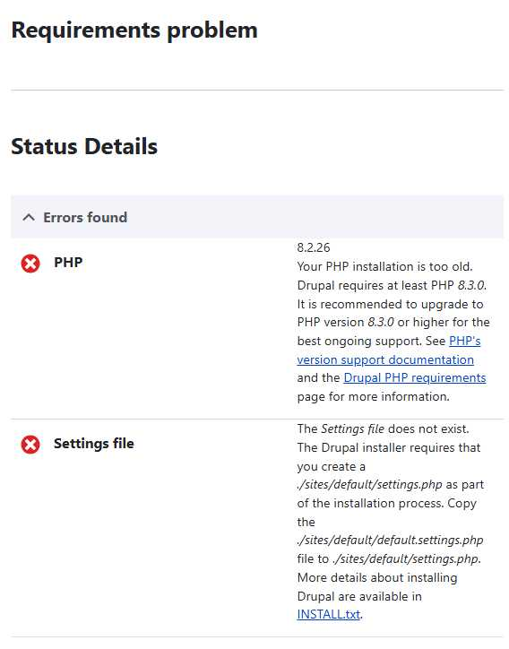
   
   `Вижу, чтобы установить drupal, необходимо обновить php до 8.3 минимум.`

   `Проверяю версию php`
   
   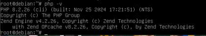
   
   `Нашел в интернете гайд, по обновлению php на Debian, и прописал все необходимые команды`

   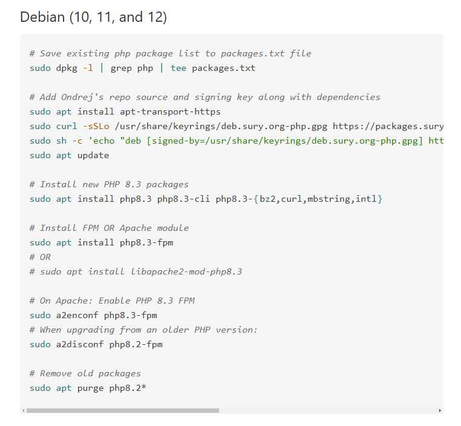

   `Проверил версию php и обновил в браузере сайт с drupal`
   
   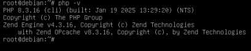
   
   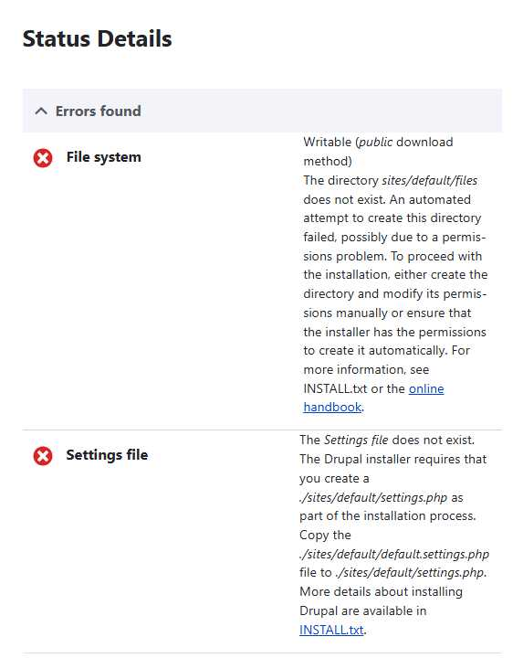

   `Теперь нужно создать директорию `site/default/site` и дать доступ к этой папке, сделал я это по гайду, который прилагается к drupal`
   
   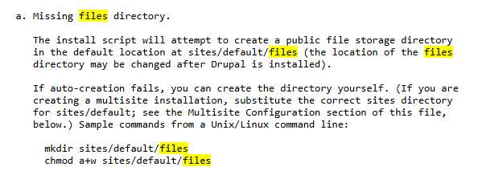

   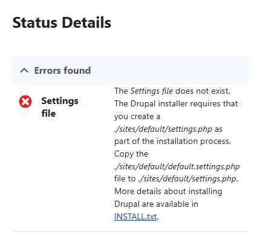

   `Далее следуя приложенному гайду, я решил проблему с settings files`

   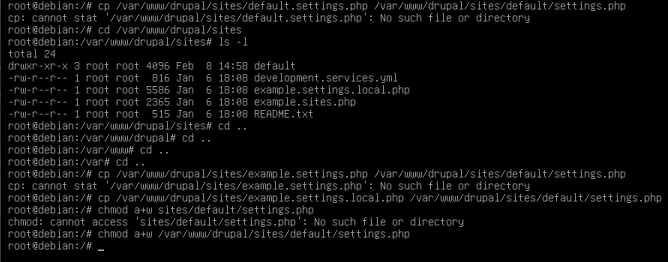

   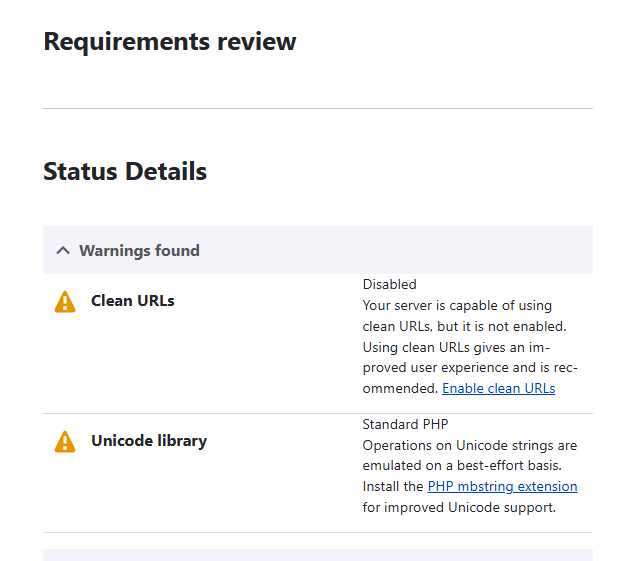

   `Все проблемы решены, теперь могу продолжить установку`

   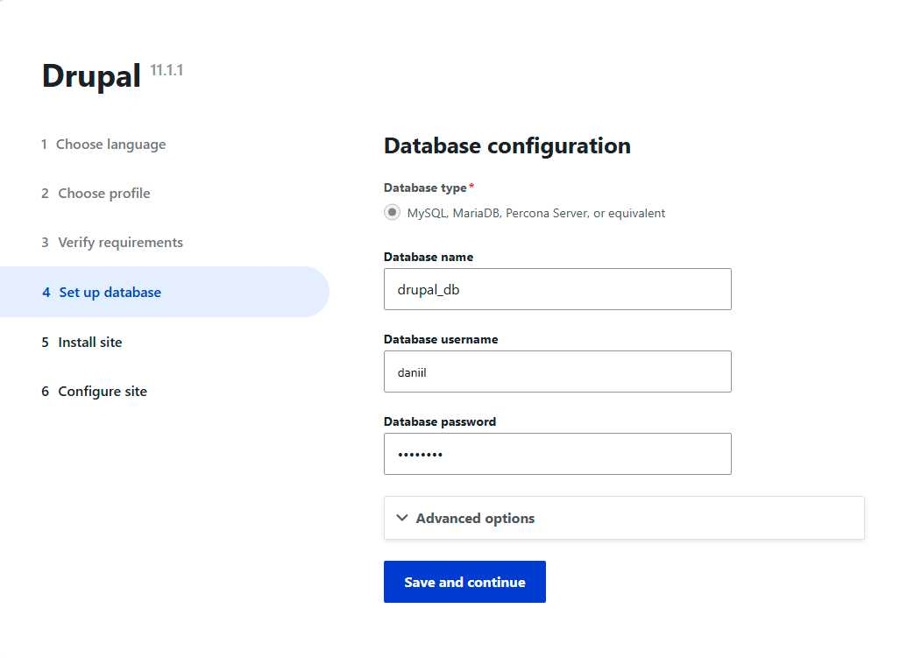
   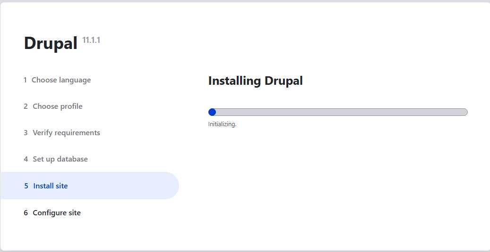

   `Заполняю информацию о сайте`
   
   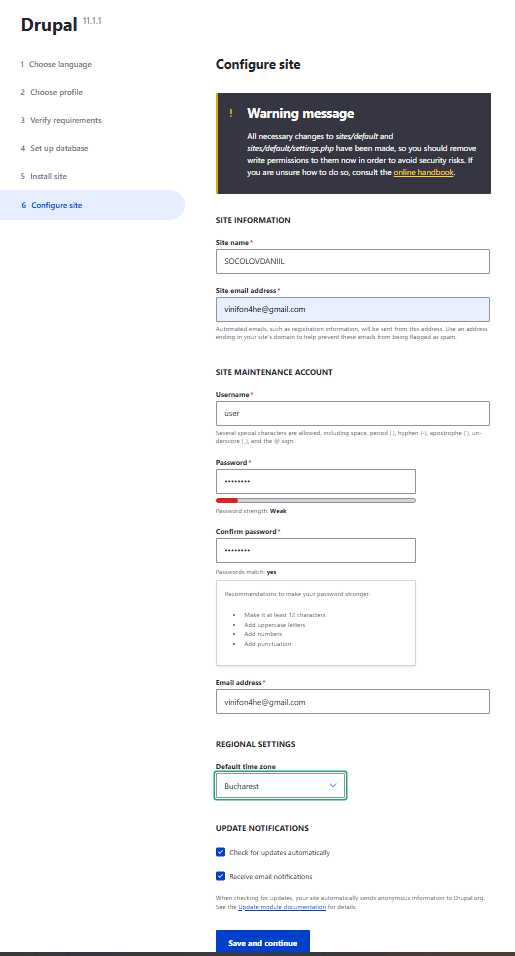

   `Drupal установлен`
   
   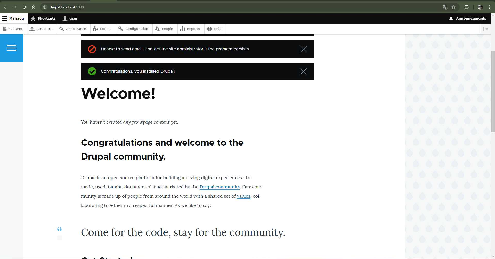
   
## Ответы на вопросы
1. **Как скачать файл с помощью wget?**
   ```sh
   wget `ссылка на скачивание файла`
   ```
2. **Зачем каждому сайту нужна своя база данных и пользователь?**

   Разделение баз данных и учетных записей пользователей для каждого сайта повышает безопасность и изолирует данные. Это предотвращает несанкционированный доступ и минимизирует риск утечки информации между различными проектами. Кроме того, это упрощает управление правами доступа и облегчает резервное копирование и восстановление данных.

3. **Как сменить порт MySQL на 1234?**

   Чтобы изменить порт MySQL на 1234, необходимо отредактировать файл конфигурации `my.cnf` (обычно расположенный по пути `/etc/mysql/my.cnf` или `/etc/my.cnf`). В этом файле найдите строку с параметром `port` и измените ее на:

   ```
   port = 1234
   ```
   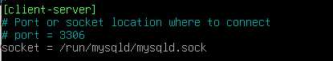

   После сохранения изменений перезапустите MySQL, чтобы новые настройки вступили в силу.

4. **Преимущества виртуализации?**

   Виртуализация предоставляет следующие преимущества:

   - **Изолированность**: Каждая виртуальная машина работает независимо, что позволяет запускать различные операционные системы и приложения на одном физическом сервере без их взаимного влияния.

   - **Экономия ресурсов**: Оптимальное использование аппаратных ресурсов за счет одновременного запуска нескольких виртуальных машин на одном сервере.

   - **Удобство тестирования**: Возможность быстро создавать, настраивать и удалять виртуальные среды для разработки, тестирования и обучения без риска повлиять на основную систему.

5. **Зачем настраивать временную зону?**

   Корректная настройка временной зоны важна для:

   - **Точности логов**: Обеспечение правильной временной метки в журналах системы и приложений, что облегчает диагностику и аудит.

   - **Планирования задач**: Гарантия того, что запланированные задачи (например, cron-задания) выполняются в нужное время, соответствующее вашему региону.

6. **Размер установленной ОС?**

   Чтобы определить размер установленной операционной системы, можно использовать команду:

   ```
   du -sh /
   ```
 В моем случае, размер составил 2,6 ГБ.

8. **Рекомендации по разбиению диска?**

   Рекомендуется создавать отдельные разделы для следующих директорий:

   - `/` (корневая): Содержит основные системные файлы.

   - `/home`: Хранит личные данные пользователей.

   - `/var`: Используется для файлов, содержимое которых часто меняется (логи, базы данных, почта).

   - `/tmp`: Предназначена для временных файлов.

## Вывод
В ходе работы были освоены базовые принципы виртуализации, установка ОС, настройка веб-сервера и базы данных, развертывание CMS Drupal и PhpMyAdmin, а также базовая конфигурация виртуальных хостов Apache. В ходе лабораторной работы я изучил некоторые аспекты работы в ОС Debian, решал появившиеся проблемы по их поступлении

## Библиография

1. Официальный сайт Debian. [https://www.debian.org](https://www.debian.org)
2. Официальный сайт MYSYS2 [https://www.msys2.org/](https://www.msys2.org/)
3. Официальная документация QEMU. [https://www.qemu.org/documentation](https://www.qemu.org/documentation)  
4. Гайд по обновлению php [https://php.watch/articles/php-8.3-install-upgrade-on-debian-ubuntu](https://php.watch/articles/php-8.3-install-upgrade-on-debian-ubuntu)
5. Нейросеть ChatGPT [https://chatgpt.com/](https://chatgpt.com/)
