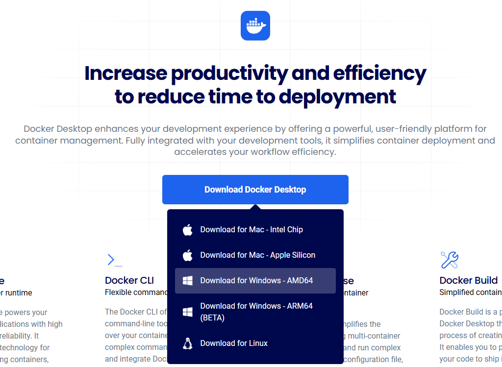
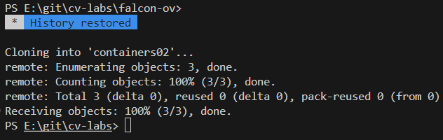
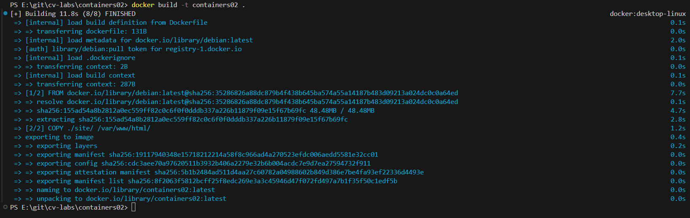
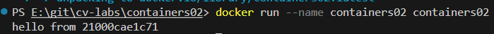
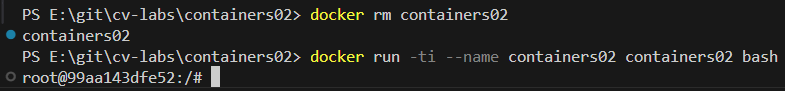
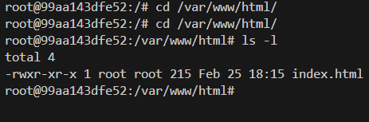
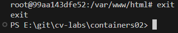

# Лабораторной работа IWNO3: Первый контейнер

## Выполнил
**Студент Соколов Даниил, группа I2302**  
**Дата выполнения: _25.02.2025_** 

## Цель работы.

Данная лабораторная работа знакомит с основами контейнеризации и подготавливает рабочее место для выполнения следующих лабораторных работ.

## Задание.

Установить Docker Desktop и проверить его работоспособность.

## Описание выполнения работы с ответами на вопросы.

### Подготовка

Скачал и установил Docker Desktop.


<!--  -->

### Выполнение

Открыл Visual Studio Code, открыл терминал, зашел в папку cv-labs.
Создал репозиторий containers02 и клонировал его себе на компьютер.

```
git clone https://github.com/falcon-ov/containers02
```




Создал в папке containers02 файл Dockerfile со следующим содержимым:


В той же папке проекта создал папку site. В новой папке создал файл index.html с произвольным содержимым.

### Запуск и тестирование

В терминал в папке containers02 и выполнил команду:

```sh
docker build -t containers02 .
```
Образ создавался `11.8` секунд.



Выполнил команду для запуска контейнера:

```sh
docker run --name containers02 containers02
```



Вывелось `hello from 21000cae1c71`, то есть выполнился скрипт `sh -c "echo hello from $HOSTNAME"` из `Dockerfile`, где `$HOSTNAME` — `21000cae1c71` уникальный идентификатор (хэш) моего контейнера, который Docker присвоил при запуске.

Удаляю контейнер и запускаю снова, выполнив команды:



Далее выполяю следующие команды, перешел по пути и посмотрел наличие файлов с подробностями:



- `total 4`: общий размер содержимого в килобайтах (4 КБ).
- `-rwxr-xr-x`: права доступа к файлу. Это значит:
- `-`: это файл (не директория).
- `rwxr-xr-x`: владелец (root) имеет права на чтение, запись и выполнение (rwx), группа и остальные пользователи — только чтение и выполнение (r-x).
- `1`: количество ссылок на файл.
- `root root`: владелец файла и группа — оба root (ты работаешь в контейнере как root-пользователь).
- `215`: размер файла в байтах (215 байт).
- `Feb 25 18:15`: дата и время создания или модификации файла (25 февраля, 18:15).
- `index.html`: имя файла, который ты скопировал из локальной папки site.

Использую команду `exit`.



## Выводы.

В ходе работы я освоил установку Docker Desktop, научился создавать и запускать контейнеры на основе Dockerfile, а также проверил их работоспособность. Задание помогло подготовить среду для дальнейшей работы с контейнерами.

# Используемые источники.
- [www.docker.com](https://www.docker.com/products/docker-desktop/)
- [github.com/mcroitor/app_containerization_ru](https://github.com/mcroitor/app_containerization_ru)
- [grok.com](https://grok.com/)
