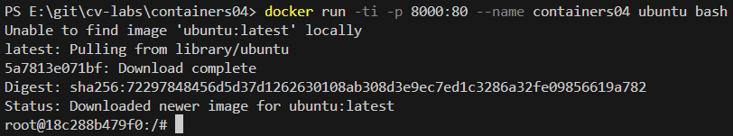
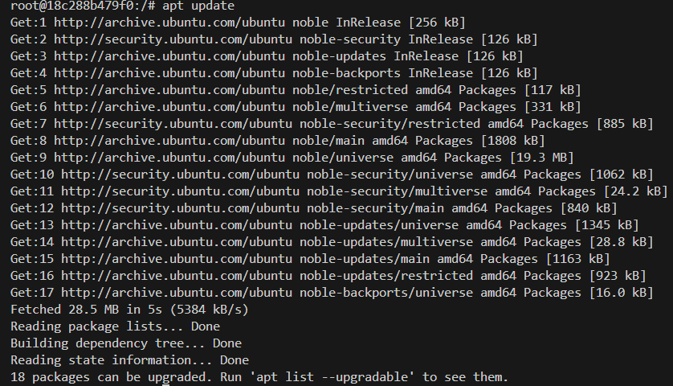
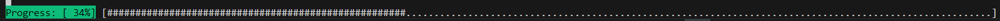
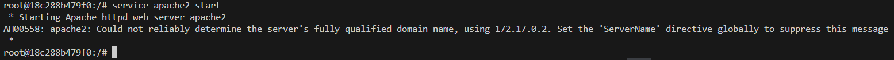
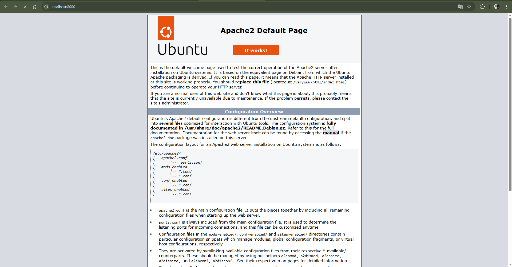
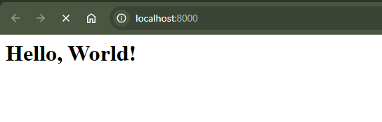
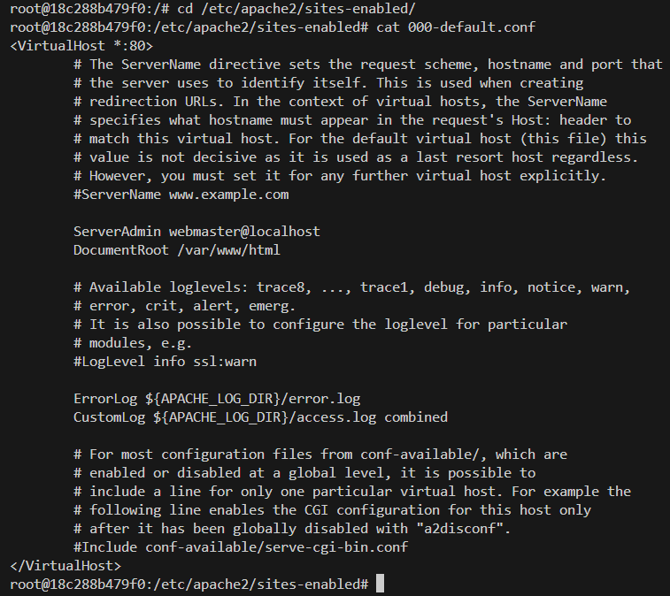
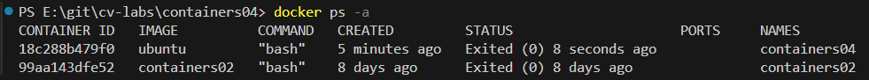
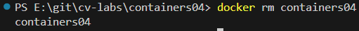

# Лабораторной работа IWNO4: Использование контейнеров как среды выполнения

## Выполнил
**Студент Соколов Даниил, группа I2302**  
**Дата выполнения: _06.03.2025_** 

## Цель работы.

Данная лабораторная работа призвана напомнить основные команды ОС Debian/Ubuntu. Также она позволит познакомиться с Docker и его основными командами.

## Задание.

Запустить контейнер Ubuntu, установить Web-сервер Apache и вывести в браузере страницу с текстом "Hello, World!".

## Описание выполнения работы с ответами на вопросы.

### Подготовка

Docker Desktop скачен и установлен.

### Выполнение

Открыл Visual Studio Code, открыл терминал, зашел в папку cv-labs.
Создал репозиторий `containers04` и клонировал его себе на компьютер.
Зашел в папку `containers04` и создал `README.md`.


### Запуск и тестирование

В терминал в папке containers04 и выполнил команду:

```sh
docker run -ti -p 8000:80 --name containers04 ubuntu bash
```
Эта команда запускает контейнер на основе Ubuntu с интерактивным терминалом Bash, доступным через порт 8000 (снаружи) → 80 (внутри), и называет его "containers04".

- `docker run` — запускает новый контейнер.
- `-ti` — комбинация флагов: `-t` выделяет терминал, `-i` делает его интерактивным (можно вводить команды).
- `-p 8000:80` — пробрасывает порт: внешний порт 8000 на хосте соединяется с портом 80 внутри контейнера.
- `--name containers04` — задаёт имя контейнеру "containers04".
- `ubuntu` — указывает образ, на основе которого создаётся контейнер (в данном случае Ubuntu).
- `bash` — команда, которая выполняется при запуске контейнера (открывает оболочку Bash).



Далее выполнил следующие команды:

```sh
apt update
apt install apache2 -y
service apache2 start
```


Команда `apt update` в `Ubuntu` (или других системах на базе Debian) используется для обновления списка доступных пакетов и их версий из репозиториев, указанных в системе, чтобы система знала, какие пакеты и версии доступны для установки или обновления.


Команда `apt install apache2 -y` устанавливает веб-сервер Apache2 в системе на базе Debian/Ubuntu с автоматическим подтверждением всех действий благодаря флагу `-y`. В результате выполнения пакет Apache2 и его зависимости загружаются из репозиториев, устанавливаются.


Команда `service apache2 start` запускает веб-сервер Apache2 в системе. В результате выполнения служба Apache2 активируется, и сервер начинает работать, обрабатывая запросы на порту 80 по умолчанию.

Открыл браузер и ввел в адресной строке `http://localhost:8000`



Я увидел следующее: стандартная страница Apache2, которая отображается при успешной установке и запуске веб-сервера на Ubuntu. Она подтверждает, что сервер работает корректно, и находится по адресу localhost (файл /var/www/html/index.html). Страница содержит логотип Ubuntu, заголовок "It works!" и краткое описание конфигурации Apache2, включая пути к файлам настроек (/etc/apache2/), структуру директорий и советы по управлению сервером (например, использование systemctl или утилит вроде a2enmod).

Выполнил следующие команды:

```sh
ls -l /var/www/html/
echo '<h1>Hello, World!</h1>' > /var/www/html/index.html
```

- `ls -l /var/www/html/` — показывает список файлов в директории `/var/www/html` с подробной информацией (права, размер, дата) в длинном формате.
- `echo '<h1>Hello, World!</h1>' > /var/www/html/index.html` — записывает строку `<h1>Hello, World!</h1>` в файл `index.html` в директории `/var/www/html`, перезаписывая его содержимое (если файл уже существует).



Я увидел, то что ввел в index.html, то есть header с текстом `Hello, World!`

Выполнил следующие команды:

```sh
cd /etc/apache2/sites-enabled/
cat 000-default.conf
```
- `cd /etc/apache2/sites-enabled/` — перехожу в директорию `/etc/apache2/sites-enabled/`, где хранятся активные конфигурации виртуальных хостов Apache2.
- `cat 000-default.conf` — вывожу содержимое файла `000-default.conf`, который содержит настройки виртуального хоста по умолчанию для порта 80, такие как `DocumentRoot` и `ServerAdmin`.



Я увидел конфигурацию виртуального хоста Apache2 по умолчанию для порта 80. Там указан `ServerAdmin` как `webmaster@localhost`, `DocumentRoot` — `/var/www/html` (где лежит страница `"It works!"`), а логи настроены на `${APACHE_LOG_DIR}/error.log` для ошибок и `${APACHE_LOG_DIR}/access.log` для доступа в формате combined. ServerName закомментирован (`#ServerName www.example.com`), так что этот хост принимает любые запросы без привязки к домену.

Закрыл окно терминала командой `exit`.

Просмотрел список контейнеров:
```sh
docker ps -a
```
Команда `docker ps -a` выводит список всех контейнеров на моей системе, включая активные, остановленные и завершившиеся. Флаг `-a` (all) показывает полную информацию, такую как имена, ID, статус и образы контейнеров, в отличие от `docker ps`, которая отображает только запущенные.



Удалил контейнер:
```sh
docker rm containers04
```
Команда `docker rm containers04` удаляет контейнер с именем `containers04` из моей системы.



## Выводы.

Я выполнил лабораторную работу, целью которого было освоить команды Debian/Ubuntu и базовые операции с Docker. Запустил контейнер Ubuntu командой `docker run -ti -p 8000:80 --name containers04 ubuntu bash`, установил Apache2 с помощью `apt update`, `apt install apache2 -y` и `service apache2 start`, затем заменил стандартную страницу, добавив `<h1>Hello, World!</h1>` в `/var/www/html/index.html`. В браузере по `http://localhost:8000` увидел свой текст, что подтвердило работу сервера. Изучил конфигурацию в `/etc/apache2/sites-enabled/000-default.conf` с настройками `ServerAdmin webmaster@localhost` и `DocumentRoot /var/www/html`. После завершил работу, удалив контейнер командой `docker rm containers04`. Задание помогло разобраться с контейнерами и настройкой веб-сервера.

# Используемые источники.
- [github.com/mcroitor/app_containerization_ru](https://github.com/mcroitor/app_containerization_ru)
- [grok.com](https://grok.com/)
