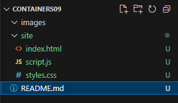
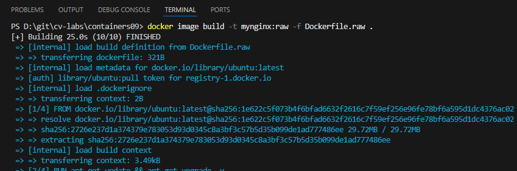
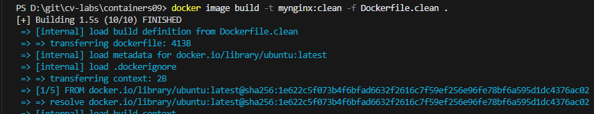
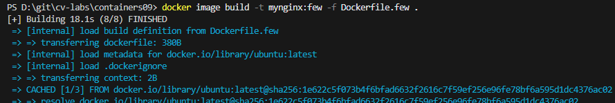
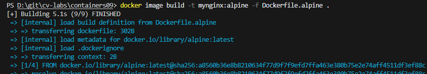
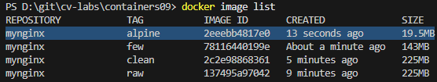
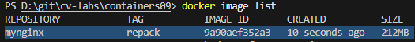
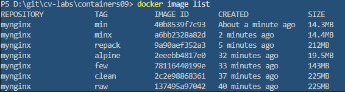

# IWNO9: Оптимизация образов контейнеров

### Подготовка
Я убедился, что на моем компьютере установлен Docker.

## Цель работы
Целью работы является знакомство с методами оптимизации образов.

## Задание
Сравнить различные методы оптимизации образов:

- Удаление неиспользуемых зависимостей и временных файлов
- Уменьшение количества слоев
- Минимальный базовый образ
- Перепаковка образа
- Использование всех методов

### Подготовка
Для выполнения данной работы необходимо иметь установленный на компьютере Docker.

### Выполнение
Я создал репозиторий `containers09` и скопировал его на свой компьютер. В папке `containers09` я создал папку `site` и поместил в нее файлы сайта (html, css, js).



#### Исходный образ
Я создал файл `Dockerfile.raw` со следующим содержимым:

```dockerfile
# create from ubuntu image
FROM ubuntu:latest

# update system
RUN apt-get update && apt-get upgrade -y

# install nginx
RUN apt-get install -y nginx

# copy site
COPY site /var/www/html

# expose port 80
EXPOSE 80

# run nginx
CMD ["nginx", "-g", "daemon off;"]
```

Я собрал образ с именем `mynginx:raw` командой:
```bash
docker image build -t mynginx:raw -f Dockerfile.raw .
```



#### Удаление неиспользуемых зависимостей и временных файлов
Я создал файл `Dockerfile.clean` с очисткой кэша и временных файлов:

```dockerfile
# create from ubuntu image
FROM ubuntu:latest

# update system
RUN apt-get update && apt-get upgrade -y

# install nginx
RUN apt-get install -y nginx

# remove apt cache
RUN apt-get clean && rm -rf /var/lib/apt/lists/* /tmp/* /var/tmp/*

# copy site
COPY site /var/www/html

# expose port 80
EXPOSE 80

# run nginx
CMD ["nginx", "-g", "daemon off;"]
```

Я собрал образ `mynginx:clean` и проверил его размер - `225MB`:
```bash
docker image build -t mynginx:clean -f Dockerfile.clean .
docker image list
```



#### Уменьшение количества слоев
Я создал файл `Dockerfile.few`, объединив команды в один слой:

```dockerfile
# create from ubuntu image
FROM ubuntu:latest

# update system
RUN apt-get update && apt-get upgrade -y && \
    apt-get install -y nginx && \
    apt-get clean && rm -rf /var/lib/apt/lists/* /tmp/* /var/tmp/*

# copy site
COPY site /var/www/html

# expose port 80
EXPOSE 80

# run nginx
CMD ["nginx", "-g", "daemon off;"]
```

Я собрал образ `mynginx:few` и проверил его размер:
```bash
docker image build -t mynginx:few -f Dockerfile.few .
docker image list
```




#### Минимальный базовый образ
Я создал файл `Dockerfile.alpine` с использованием базового образа Alpine:

```dockerfile
# create from alpine image
FROM alpine:latest

# update system
RUN apk update && apk upgrade

# install nginx
RUN apk add nginx

# copy site
COPY site /var/www/html

# expose port 80
EXPOSE 80

# run nginx
CMD ["nginx", "-g", "daemon off;"]
```

Я собрал образ `mynginx:alpine` и проверил его размер:
```bash
docker image build -t mynginx:alpine -f Dockerfile.alpine .
docker image list
```





#### Перепаковка образа
Я перепаковал образ `mynginx:raw` в `mynginx:repack`:
```bash
docker container create --name mynginx mynginx:raw
docker export mynginx -o mynginx.tar
docker import mynginx.tar mynginx:repack
docker container rm mynginx
docker image list
```



#### Использование всех методов
Я создал файл `Dockerfile.min` с применением всех методов оптимизации:

```dockerfile
# create from alpine image
FROM alpine:latest

# update system, install nginx and clean
RUN apk update && apk upgrade && \
    apk add nginx && \
    rm -rf /var/cache/apk/*

# copy site
COPY site /var/www/html

# expose port 80
EXPOSE 80

# run nginx
CMD ["nginx", "-g", "daemon off;"]
```

Я собрал образ `mynginx:minx`, перепаковал его в `mynginx:min` и проверил размеры:
```bash
docker image build -t mynginx:minx -f Dockerfile.min .
docker container create --name mynginx mynginx:minx
docker container export mynginx -o mynginx.tar
docker image import mynginx.tar mynginx:min
docker container rm mynginx
docker image list
```


### Запуск и тестирование
Я проверил размеры всех образов командой:
```bash
docker image list
```



### Таблица размеров образов
| Образ            | Размер   |
|------------------|----------|
| mynginx:raw      | 225 MB   |
| mynginx:clean    | 225 MB   |
| mynginx:few      | 143 MB   |
| mynginx:alpine   | 19.5 MB  |
| mynginx:repack   | 212 MB   |
| mynginx:minx     | 14.4 MB  |
| mynginx:min      | 14.3 MB  |

### Ответы на вопросы
1. **Какой метод оптимизации образов я считаю наиболее эффективным?**  
   Я считаю использование минимального базового образа (Alpine) наиболее эффективным, так как оно сократило размер образа с ~225 МБ до ~14.3–19.5 МБ (образы `mynginx:alpine`, `mynginx:minx`, `mynginx:min`).

2. **Почему очистка кэша пакетов в отдельном слое не уменьшает размер образа?**  
   Очистка кэша в отдельном слое не уменьшает размер, так как Docker сохраняет промежуточные слои, включая те, где кэш еще присутствует. Для уменьшения размера очистку нужно выполнять в том же слое, где устанавливаются пакеты.

3. **Что такое перепаковка образа?**  
   Перепаковка образа — это экспорт файловой системы контейнера в tar-архив и импорт его как нового образа с одним слоем. В моем случае (`mynginx:repack`, 212 МБ) это не дало значительного уменьшения размера.

### Выводы
Я изучил методы оптимизации Docker-образов. Наиболее эффективным оказалось использование минимального базового образа Alpine, сократившее размер до ~14.3–19.5 МБ (образы `mynginx:min`, `mynginx:minx`, `mynginx:alpine`). Комбинирование методов (образ `mynginx:min`) дало лучший результат (~14.3 МБ). Я понял, что объединение команд в один слой и очистка кэша в том же слое критически важны для минимизации размера образа. Перепаковка оказалась менее эффективной, так как размер `mynginx:repack` остался высоким (212 МБ).

### Ссылка на репозиторий
[Ссылка на репозиторий containers09](https://github.com/username/containers09)