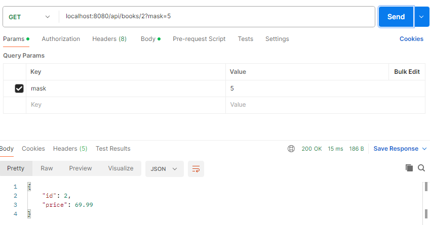
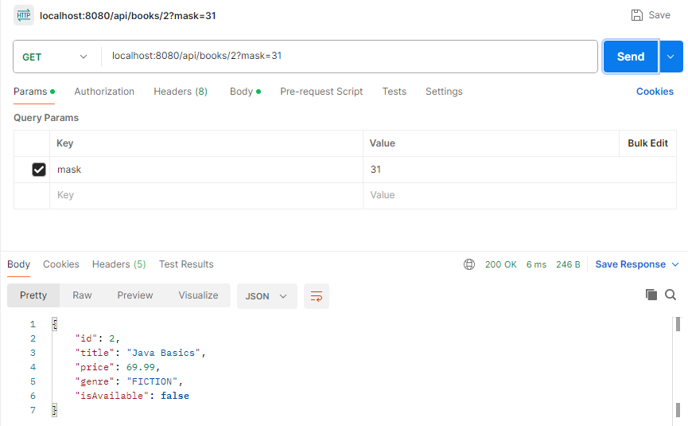

# Лабораторная работа #1

- Тема: **Field Mask**
- Выполнил: Даниил Соколов 
- Группа: I2302(ru)

## Концепты

- Инкапсуляция
- Domain Model
- Маски (как коллекция bool-ов)
- Создание более мощных абстракций на основе абстракций

## Задание

### Структура проекта:
```text
SoftwareDesignLab1AdvancedSpring/
├── SoftwareDesignLab1AdvancedSpringApplication.java
├── controller/
│   └── BookController.java
├── dto/
│   └── BookMaskedDTO.java
├── model/
│   └── Book.java
├── repository/
│   ├── BookRepository.java
│   └── InMemoryBookRepository.java
└── util/
    ├── BookFieldMask.java
    ├── MaskUtils.java
    └── PrintHelper.java

```

1. Сделайте domain model класс с хотя бы 5 полями, среди которых `int, string, float, enum`.
```java
package com.example.softwaredesignlab1advancedspring.model;

// Domain Model: класс Book инкапсулирует данные о книге
public class Book {

    // Конструктор для инициализации всех полей
    public Book(int id, String title, float price, Genre genre, boolean isAvailable) {
        this.id = id;
        this.title = title;
        this.price = price;
        this.genre = genre;
        this.isAvailable = isAvailable;
    }

    // Enum — один из типов поля, как требует задание
    public enum Genre {FICTION, NONFICTION, SCIENCE, HISTORY}

    // Приватные поля — демонстрация инкапсуляции
    private int id;               // int
    private String title;         // string
    private float price;          // float
    private Genre genre;          // enum
    private boolean isAvailable;  // boolean — дополнительное поле

    // Геттеры и сеттеры — обеспечивают доступ к инкапсулированным данным
    public int getId() {
        return id;
    }

    public void setId(int id) {
        this.id = id;
    }

    public String getTitle() {
        return title;
    }

    public void setTitle(String title) {
        this.title = title;
    }

    public float getPrice() {
        return price;
    }

    public void setPrice(float price) {
        this.price = price;
    }

    public Genre getGenre() {
        return genre;
    }

    public void setGenre(Genre genre) {
        this.genre = genre;
    }

    public boolean isAvailable() {
        return isAvailable;
    }

    public void setAvailable(boolean available) {
        isAvailable = available;
    }
}

```
2. Сделайте абстракцию под базу данных, хранящую эти объекты.
   Имплементация не принципиальна, можно хранить их просто в массиве под капотом.
```java
// Интерфейс репозитория для работы с сущностью Book.
// Определяет базовые операции: добавление, поиск по названию, поиск по ID и получение всех книг.
package com.example.softwaredesignlab1advancedspring.repository;

import com.example.softwaredesignlab1advancedspring.model.Book;
import java.util.List;

public interface BookRepository {
    // Метод для добавления новой книги в хранилище
    void add(Book book);

    // Метод для поиска книг по названию (может вернуть несколько книг)
    List<Book> findByTitle(String title);

    // Метод для поиска книги по уникальному идентификатору
    Book findById(int id);

    // Метод для получения списка всех книг
    List<Book> getAll();
}
```
```java
// Реализация интерфейса BookRepository с использованием in-memory хранилища (список в памяти).
// Аннотация @Repository указывает Spring, что этот класс является компонентом доступа к данным.
package com.example.softwaredesignlab1advancedspring.repository;

import com.example.softwaredesignlab1advancedspring.model.Book;
import org.springframework.stereotype.Repository;

import java.util.ArrayList;
import java.util.List;

@Repository
public class InMemoryBookRepository implements BookRepository {
    // Внутреннее хранилище книг — список, хранящий все добавленные книги
    private List<Book> books = new ArrayList<>();

    // Добавляет книгу в список
    @Override
    public void add(Book book) {
        books.add(book);
    }

    // Ищет книги по названию (без учета регистра)
    @Override
    public List<Book> findByTitle(String title) {
        return books.stream()
                .filter(b -> b.getTitle().equalsIgnoreCase(title)) // сравнение без учета регистра
                .toList(); // преобразование результата в список
    }

    // Ищет книгу по ID. Если не найдена — возвращает null
    @Override
    public Book findById(int id) {
        return books.stream()
                .filter(book -> book.getId() == id) // фильтрация по ID
                .findFirst() // получение первого совпадения
                .orElse(null); // если не найдено — вернуть null
    }

    // Возвращает все книги из хранилища
    @Override
    public List<Book> getAll() {
        return books;
    }
}
```
3. Создайте класс маски полей (сначала как bool).

Bool реализация:
```java
package util;

public class BookFieldMask {
    public boolean showId;
    public boolean showTitle;
    public boolean showPrice;
    public boolean showGenre;
    public boolean showAvailability;

    public BookFieldMask(boolean showId, boolean showTitle, boolean showPrice, boolean showGenre, boolean showAvailability) {
        this.showId = showId;
        this.showTitle = showTitle;
        this.showPrice = showPrice;
        this.showGenre = showGenre;
        this.showAvailability = showAvailability;
    }
}
```
4. Реализуйте метод в абстракции базы данных, которая совершает поиск всех объектов по одному из полей (например, `FindByName(string)`).
```java
    public List<Book> findByTitle(String title) {
        return books.stream()
                .filter(b -> b.getTitle().equalsIgnoreCase(title))
                .toList();
    }

    public Book findById(int id) {
        return books.stream()
                .filter(book -> book.getId() == id)
                .findFirst()
                .orElse(null);
    }
```
5. Реализуйте статическую функцию, которая печатает в консоль значения полей, согласно переданной маски.
```java
package com.example.softwaredesignlab1advancedspring.util;

import com.example.softwaredesignlab1advancedspring.model.Book;

public class PrintHelper {
    public static void print(Book book, int mask) {
        if ((mask & BookFieldMask.ID) != 0) {
            System.out.println("ID: " + book.getId());
        }
        if ((mask & BookFieldMask.TITLE) != 0) {
            System.out.println("Title: " + book.getTitle());
        }
        if ((mask & BookFieldMask.PRICE) != 0) {
            System.out.println("Price: " + book.getPrice());
        }
        if ((mask & BookFieldMask.GENRE) != 0) {
            System.out.println("Genre: " + book.getGenre());
        }
        if ((mask & BookFieldMask.AVAILABILITY) != 0) {
            System.out.println("Available: " + book.isAvailable());
        }
    }
}
```
6. Протестируйте программу. ☑




## **Дальнейшие задания (как минимум 3 на выбор)**:

- Реализуйте это в виде JSON REST API (возврат объекта не со всеми полями) (ASP.NET Core).
```java
package com.example.softwaredesignlab1advancedspring.controller;

import com.example.softwaredesignlab1advancedspring.dto.BookMaskedDTO;
import com.example.softwaredesignlab1advancedspring.model.Book;
import com.example.softwaredesignlab1advancedspring.repository.BookRepository;
import com.example.softwaredesignlab1advancedspring.repository.InMemoryBookRepository;
import org.springframework.web.bind.annotation.*;

@RestController
@RequestMapping("/api/books")
public class BookController {

    private final InMemoryBookRepository repo;

    public BookController(InMemoryBookRepository repo) {
        this.repo = repo;
    }

    @GetMapping("/{id}")
    public BookMaskedDTO getBookById(
            @PathVariable int id,
            @RequestParam(defaultValue = "31") int mask // по умолчанию все поля
    ) {

        return new BookMaskedDTO(repo.findById(id), mask);
    }
}
```
- Переделайте маску полей на основе битов.

Битовая реализация:
```java
package com.example.softwaredesignlab1advancedspring.util;

public class BookFieldMask {
    public static final int ID = 1;           // 00001
    public static final int TITLE = 2;        // 00010
    public static final int PRICE = 4;        // 00100
    public static final int GENRE = 8;        // 01000
    public static final int AVAILABILITY = 16;// 10000
}
```

- Сделайте 3 метода, работающие на основе масок, комбинирующих их тем или иным полезным образом.
```java
package com.example.softwaredesignlab1advancedspring.util;

public class MaskUtils {
    public static int combineMasks(int mask1, int mask2) {
        return mask1 | mask2;
    }

    // Метод 2: пересечение масок
    public static int intersectMasks(int mask1, int mask2) {
        return mask1 & mask2;
    }

    // Метод 3: исключение маски
    public static int excludeMask(int mask, int exclude) {
        return mask & ~exclude;
    }

    // Дополнительно: проверка, входит ли поле в маску
    public static boolean isFieldIncluded(int mask, int field) {
        return (mask & field) != 0;
    }
}
```

## Вывод

В рамках лабораторной работы была реализована система управления объектами с использованием концепта Field Mask. 
Создана domain-модель Book с инкапсулированными полями различных типов (int, string, float, enum, boolean). 
Для хранения объектов разработан in-memory репозиторий с базовыми методами поиска и добавления.

Основной акцент сделан на абстракции маски полей — сначала в виде набора булевых значений, затем в виде битовой маски, 
что позволило гибко управлять отображением данных. Реализована утилита для печати объектов согласно маске, 
а также методы для комбинирования, пересечения и исключения масок. Дополнительно добавлен REST API, 
возвращающий DTO с учетом маски.

Работа демонстрирует принципы инкапсуляции, абстрагирования и расширяемости, а также применение битовых операций 
для оптимизации логики отображения данных.
